# LM-PRUEBA-R2-RLM-1-DAM

## Informe de Evidencias

## Ejercicio 1


### 1A. Pregunta
### ¿Por qué NO se centra el texto del 'h1' en este caso? Explícalo con tus palabras. (por qué visual y estructuralmente no aparece centrado entre el borde izquierdo y el menú)

Ya que estás colocando el h1 aparte del .site-header y este h1 debería estar enlazado de alguna manera con el .site-header para que gracias al flex pueda centrarse el texto. Entonces, con el text-align no es suficiente para centrarlo

Debería colocarse de la siguiente manera para que el flex haga efecto sobre él:

".site-header h1 {

  text-align: center;
  
}"


### 1B. Ejercicio: Soluciona de dos formas diferentes

Primero veremos como podemos arreglar esto con flex:


Como podemos observar, el h1 está unido al .site-header y como en él están los ajustes del flex, el h1 se encuentra centrado en el texto.

Ahora veremos el caso con grid:


Aquí podemos observar que el grid se encarga de centrar el h1 y las opciones quedan por debajo del h1 como la siguiente imagen:


### 1C. Ejercicio: Convertir la cabecera en dos filas


### 1D. Ejercicio: Dar relieve y separación visual al header


<hr>

## Ejercicio 2: Reorganización del header con tres elementos


### 2A. Ejercicio


### 2B. Ejercicio 

Como se ve ahora la página: 


CSS:


<hr>

## Ejercicio 3
### 3A. Crear miniaturas


### 3B. Efecto hover


### 3C. Enlace a la imagen original 


<hr>

## Ejercicio 4: Informe de evidencias del proyecto (defensa técnica simple)

### 4.1. Introducción

Para esta prueba, decide crear una página web centrada en uno de mis videojuegos favoritos: Time Traveler. Para la página decide incluir una pequeña sipnosis sobre la narrativa del juego, una galería de imágenes que contiene algunas imágenes del juego, una tabla con las especificaciones del juego, como lo serían el nombre de la creadora, el año de publicación...
Luego podemos encontrar un formulario para contactarse con la desarrolladora de la página para saber más del juego y por último encontramos diversos links sobre las redes sociales y la página donde se descargan los de la creadora. 

Para el diseño de la página he tomado la paleta de colores del juego, en el que se destaca mucho tonos de color azul. En el header decidí colocar algunos sprites del juego para representar a los personajes más importantes en su narrativa. Se buscaba respetar mucho los espacios para que se aprecie más lo visual de la página. Para el botón de la parte superior izquierda decidí utilizar unos assets del juego de la protagonista con el ojo abierto y cerrado si se abre. 

### 4.2. Evidencias de HTML5

1. Header
   
En el header, con una class "site-header", podemos encontrar el título de la página dentro de un h1, luego los sprites de los personajes más importantes del juego que se encuentran dentro de un figure. Después encontramos un nav con class "main-nav" que hace referencia a las diferentes secciones de la página para poder acceder a ellas mediante enlaces. A continuación tenemos un botón que sirve para el menú lateral, que funciona con JavaScript y por último encontramos otro nav con id "sideMenu" y un class "side-menu". En este otro nav se utiliza para el menú lateral el cual tiene unos enlaces que nos llevan a cada sección de la página, al igual que el primer nav.

```html
<header class="site-header">
    <h1>Time Traveler</h1> 
    <figure>
      
      
      
      
      
      
    </figure>
    
    <nav class="main-nav">
        <a href="#hero">Inicio</a>
        <a href="#galeria">Galería</a>
        <a href="#tab">Tabla</a>
        <a href="#for">Formulario</a>
        <a href="#con">Contacto</a>
    </nav>

    <button class="open-menu" aria-label="Abrir menú lateral"></button>

    <nav id="sideMenu" class="side-menu">
        <a href="#hero">Inicio</a>
        <a href="#galeria">Galería</a>
        <a href="#tab">Tabla</a>
        <a href="#for">Formulario</a>
        <a href="#con">Contacto</a>
    </nav>
  </header>
```

Así es como se vería en la página: 
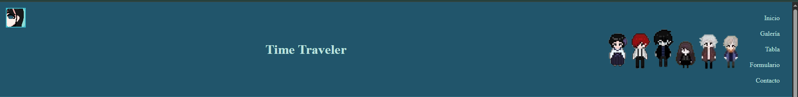
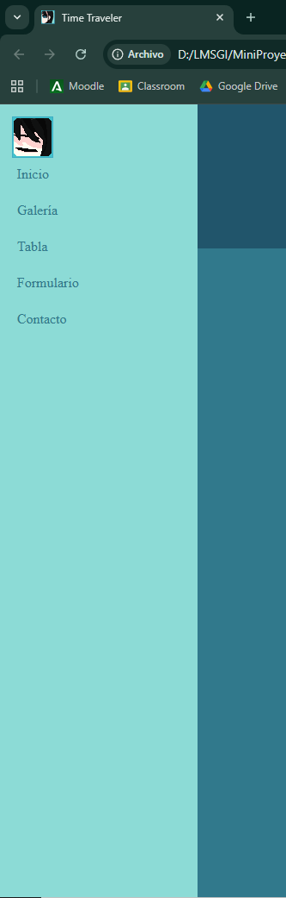

2. Main


El main, que es donde se recoge todo el contenido de la página web, se encuentra compuesto por todas las secciones que podemos encontrar en la página web, por lo tanto, iremos sección por sección viendo cada una de ellas:

  2.1. Section Hero

  
  Este primer section, con id "hero", encontramos otro header el cual sirve para el título de la sección.       Luego, encontramos un article el cual abarca todo el texto y la imagen que se encuentran ahí. Hay un h3 para el subtítulo del texto que hay a continuación  
  
```html
  <section id="hero">
      <header>
        <br>
        <h2>¡Bienvenido al mundo de Time Traveler!</h2>
        <br>
      </header>
      <article>
        <h3>Sinopsis</h3>
        <hr>
        <p>La joven <strong>Mizuno Mai</strong> es el resultado de la relación entre un espíritu y un ser humano. Ella se encuentra desde el principio de su vida atrapada en muchos misteriosos y curiosos mundos donde en cada uno hay seres, llamados <strong><em>Guardianes</em></strong>.</p>
        <p>Pero su nacimiento rompió las reglas de <strong>Dios</strong>. Y su abuelo está detrás de ella en orden de borrar su existencia y todo alrededor de ella.</p>
        <p>Debido a esto, con un poco de ayuda ella será capaz de viajar al <strong>pasado</strong>, <strong>presente</strong> y <strong>futuro</strong>, y necesitará crecer en muchas maneras para enfrentar sus miedos</p>
        <br>
        <figure>
              
        </figure>
        <br>
      </article>
    </section>
```
  
  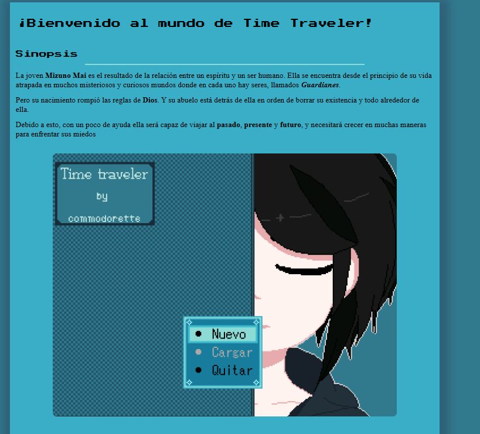
    
  2.2. Section Galería de Imágenes

  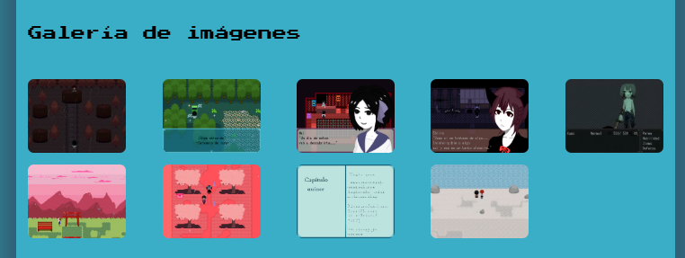
  
  2.3. Section Tabla/Especificaciones

  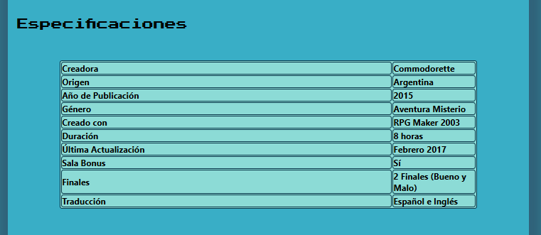
  
  2.4. Section Formulario
  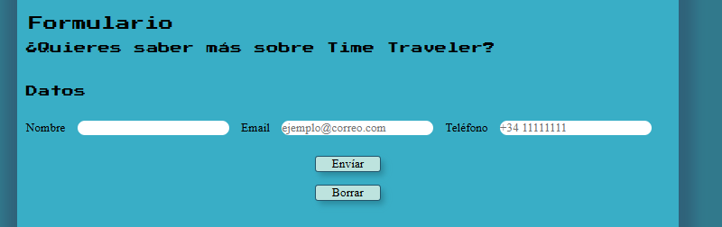
  
  2.5. Section Contacto
  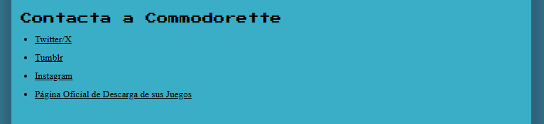
   

3. Footer
   


4. Enlaces Externos
   
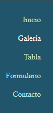
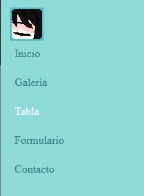
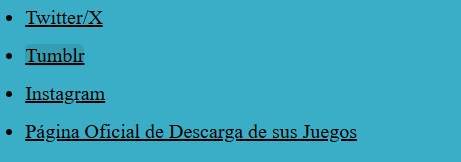
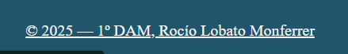
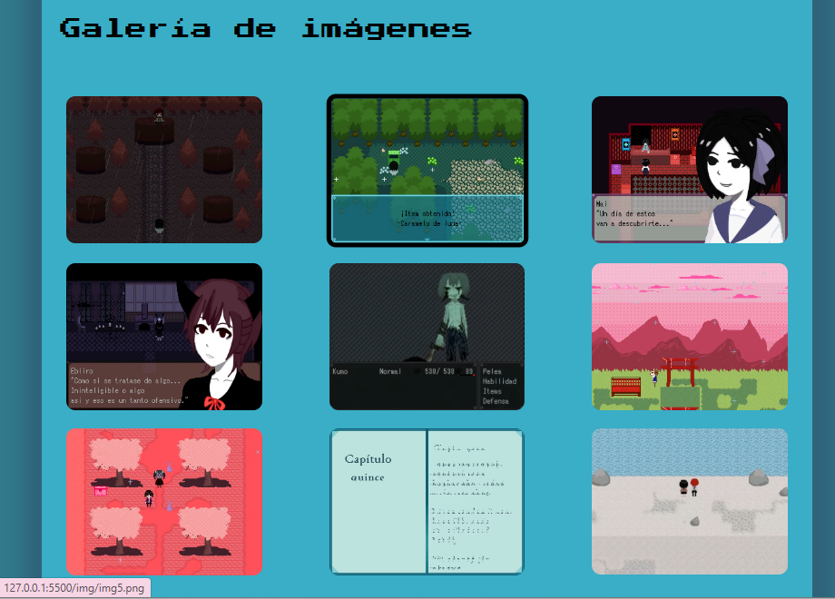

### 4.3. Evidencias de CSS

Este sería el CSS utilizado para esta práctica:

```css
/* ===== RESET CSS básico ===== */
*, *::before, *::after {
  margin: 0;
  padding: 0;
  box-sizing: border-box;
}

/* ===== FONTS NECESARIOS ===== */

@font-face {
  font-family: "Título h1";
  src: url("fonts/Digital\ Change\ Demo.ttf") format('truetype');
} 

@font-face {
  font-family: "Opciones";
  src: url("fonts/Blackney-Bold.ttf") format('truetype');
}

@font-face {
  font-family: "text";
  src: url("fonts/Petrona-VariableFont_wght.ttf") format('truetype');
}

/* ===== ESTILOS BASE ===== */
body {
  font-family: system-ui, -apple-system, "Segoe UI", sans-serif;
  background-color: #31798c;
}

main {
    width: min(1100px, 90%);
    margin: 20px auto;
    background-color: #39aec6;
    box-shadow: 3px 14px 19px 22px #2e546e99;
}

p {
  font-family: "text";
  margin: 15px;
  font-size: 20px;
}

hr {
  width: 65%;
  margin: auto;
  border: #8cdbd6 solid 2px;
}

/* ===== CABECERA Y MENÚ SUPERIOR ===== */
.site-header { 
  position: sticky;
  top: 0;
  z-index: 10;
  background-color: #21556b;
  display: flex;
  align-items: center;
  color: #bde3de;
  padding: 20px;
}

.site-header h1 {
  font-family: "Título h1";
  margin: 30px auto;
  padding: 30px;
  text-align: center;
}

.main-nav ul {
  list-style: none;
  display: flex;
  gap: 10px;
}

.main-nav a {
  color: #bde3de;
  padding: 10px;
  font-family: "Opciones";
  text-decoration: none;
  display: flex;
  flex-direction: row;
  justify-content: right;
}

.main-nav a:hover {
  color: whitesmoke;
}

.site-header figure {
  margin: 10px;
}

.chibi:hover {
  transform: scale(1.03);
}

/* ===== BOTÓN HAMBURGUESA PARA GESTIONAR EL MENÚ LATERAL ===== */

.open-menu {
  position: fixed;
  top: 14px;
  left: 14px;
  z-index: 20;
  font-size: 26px;
  cursor: pointer;
  background: none;
  border: none;
  transition: transform 0.3s ease, background-color 0.3s ease;
}

/* ===== MENÚ LATERAL DESLIZANTE ===== */
.side-menu {
  position: fixed;
  top: 0;
  left: -230px;            
  width: 230px;
  height: 100%;
  background-color: #8cdbd6;
  padding-top: 60px;
  transition: left 0.3s ease;
  z-index: 15;
  font-family: "Opciones";
  display: flex;
  flex-direction: column;
}

.side-menu.active {
  left: 0;   
}

.side-menu ul {
  list-style: none;
  padding: 0;
}

.side-menu a {
  display: block;
  padding: 12px 20px;
  color: #31798c;
  text-decoration: none;
}

.side-menu a:hover {
  color: whitesmoke;
}

/* ===== HERO ===== */

#hero figure img {
    height: auto;
    margin: auto;
    display: block;
    width: 80%;
    object-fit: cover;
    border-radius: 10px;
}

/* ===== TITULOS ===== */

h2 {
  font-family: "Press Start 2P", system-ui;
  font-weight: 400;
  font-style: normal;
  width: 100%;
  margin: 20px;
}

h3 {
  margin: 15px;
  font-family: "Press Start 2P", system-ui;
  font-weight: 400;
  font-size: 20px;
  width: 100%;
  font-style: normal;
}

/* ===== GALERÍA ===== */

#galeria figure {
  display: grid;
  grid-template-rows: repeat(auto-fill, minmax(200px, autofr));
  grid-template-columns: repeat(auto-fill, minmax(200px, 1fr));
  gap: 20px;
}

#galeria img {
    width: 80%;
    height: auto;
    object-fit: cover;
    border-radius: 10px;
    margin: auto;
    display: block;
}

#galeria img:hover {
  transform: scale(1.03);
  border: #000 solid 5px;
}

/* ===== TABLA DE DATOS ===== */

table, th {
  border: 2px solid #093649;
  width: 80%;
  margin: auto;
  background-color: #8cdbd6;
  text-align: left;
  font-size: large;
  border-radius: 5px;
}

/* ===== FORMULARIO ===== */

legend {
  font-family: "Press Start 2P", system-ui;
}

fieldset, input {
  font-family: "text";
  font-size: 20px;
  padding: auto;
  margin: 15px;
  border-radius: 15px;
  border: #8cdbd6;
}

 input.boton {
  background-color: #bde3de;
  margin: 20px auto;
  box-shadow: 6px 7px 10px -1px rgba(37,121,138,0.68);
  border: #21556b solid 2px;
  cursor: pointer;
  border-radius: 5px;
  display: flex;
  justify-content: space-between;
  width: 10%;
 }

 input.boton:hover{
  background-color: #a7ccc7;
  border-radius: 5px;
  box-shadow: 4px 5px 8px -1px rgba(37, 121, 138, 0.80);
 }

/* ===== CONTACTO ===== */

#con a {
  color: #000;
}

#con a:hover {
    background-color: #359eb3;
    border-radius: 5px;
}

#con li {
  font-family: "text";
  margin: 15px;
  font-size: 20px;
  margin-left: 50px;
}

/* ===== PIE DE PÁGINA ===== */

.site-footer {
  background-color: #21556b;
  text-align: center;
  padding: 20px;
  font-family: "Opciones";
  color: #bde3de;
}

.site-footer a:visited {
    text-align: center;
    color: #bde3de;
}

.site-footer a:hover{
  color: whitesmoke;
}
```

A continuación veremos ejemplos de algunas cosas utilizadas en este CSS:

Lo primero que destacaremos son los selectores:

```css
#hero figure img {
    height: auto;
    margin: auto;
    display: block;
    width: 80%;
    object-fit: cover;
    border-radius: 10px;
}
```
Como podemos observar aquí, encontramos el id hero y que se espeficica que de ese hero el estilo se pondrán en una imagen dentro de un figure. Decidí hacerlo así ya que es más cómodo seleccionar la imagen del hero.

Un ejemplo de un selector de class sería el siguiente:

```css
.open-menu {
  position: fixed;
  top: 14px;
  left: 14px;
  z-index: 20;
  font-size: 26px;
  cursor: pointer;
  background: none;
  border: none;
  transition: transform 0.3s ease, background-color 0.3s ease;
}
```

A continuación veremos las pseudoclases: 

```css
.side-menu a:hover {
  color: whitesmoke;
}
```
Aquí podemos observar que la pseudoclase sería :hover, que sirve para que cuando el cursos pase por esa zona, el texto se vuelva del color indicado. Lo utilizamos para que se note las opciones al pasar el cursor por ellas. 

Lo siguiente que veremos será un ejemplo de Grid:

```css
#galeria figure {
  display: grid;
  grid-template-rows: repeat(auto-fill, minmax(200px, autofr));
  grid-template-columns: repeat(auto-fill, minmax(200px, 1fr));
  gap: 20px;
}
```

Primero, se necesita iniciar el grid con "display: grid;" y los siguientes dos líneas sriven para definir las columnas y filas que queremos. El "repeat(auto-fill)" selecciona cuantas filas o columnas colocar dependiedno de cuantas imágenes haya en el figure. El "minmax(200px, autofr/1fr)" sirve para poner un tamaño a las imágenes y el fr sirve para definir el espacio fraccional disponible para cada imágen. Por último, el gap es la separación que hay en cada columna o fila.

Decidí hacerlo así para poder organizar las imágenes de una mejor manera y que quede bien presentado. 

Ahora veremos el uso de box-shadow:

```css
input.boton:hover{
  background-color: #a7ccc7;
  border-radius: 5px;
  box-shadow: 4px 5px 8px -1px rgba(37, 121, 138, 0.80);
 }
```

Como podemos ver, el box-shadow se utiliza en los botones de "Enviar" y "Borrar" de la sección Formulario. Se utiliza para poder destacar bien los botones y para dar una sensación de 3D.

Por último, veremos los estilos de los menús:

```css
.side-menu {
  position: fixed;
  top: 0;
  left: -230px;            
  width: 230px;
  height: 100%;
  background-color: #8cdbd6;
  padding-top: 60px;
  transition: left 0.3s ease;
  z-index: 15;
  font-family: "Opciones";
  display: flex;
  flex-direction: column;
}

.side-menu.active {
  left: 0;   
}

.side-menu ul {
  list-style: none;
  padding: 0;
}

.side-menu a {
  display: block;
  padding: 12px 20px;
  color: #31798c;
  text-decoration: none;
}

.side-menu a:hover {
  color: whitesmoke;
}
```

Como podemos observar aquí, en ".side-menu" sirve para colocar correctamente el menú lateral, es decir, que se ubique a la izquierda de la página y se abra si haces clic en el botón. El resto de detalles son colores para las letras de las opciones combinen con la estética de la página y el ":hover" para cuando se pase el cursor encima cambie el color de las opciones y se note. La fuente "Opciones" sirve para diferenciar del resto de fuentes de la página.

Algo similar ocurre con el menú de la derecha:

```css
.main-nav ul {
  list-style: none;
  display: flex;
  gap: 10px;
}

.main-nav a {
  color: #bde3de;
  padding: 10px;
  font-family: "Opciones";
  text-decoration: none;
  display: flex;
  flex-direction: row;
  justify-content: right;
}
```


### 4.4. Fuentes utilizadas


### 4.5. Menú lateral: breve explicación


### 4.6. Conclusión personal


